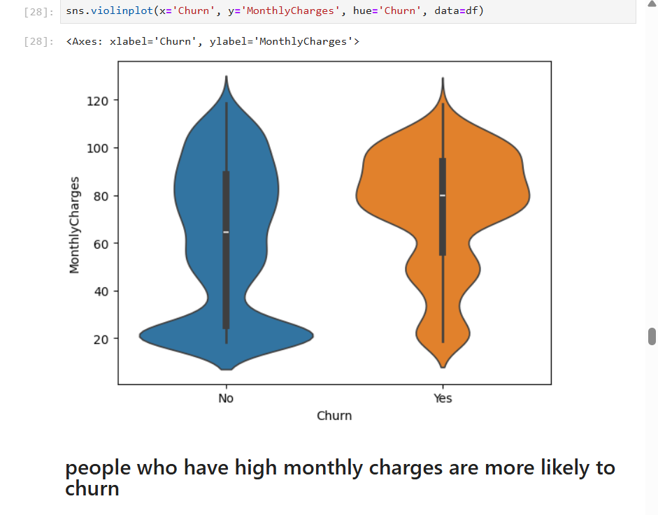
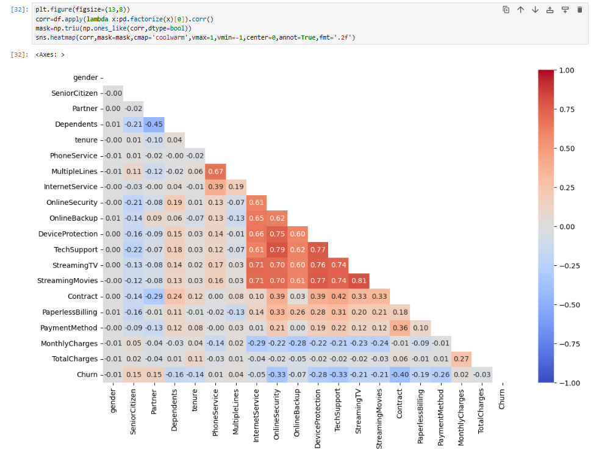
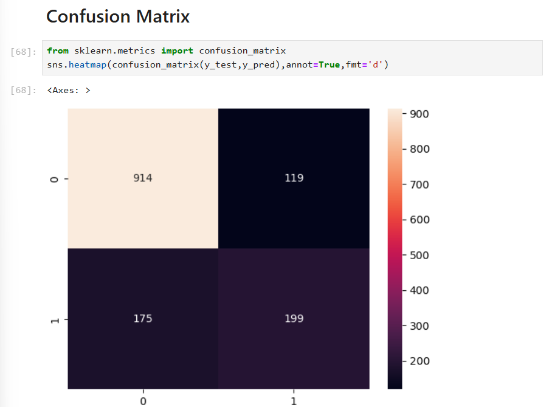

# 🚀 Customer Churn Analysis using SQL & Python

---

## 📌 Overview

This project focuses on analyzing and predicting **customer churn** using SQL and Python.  
The goal is to identify key factors driving customer attrition and provide **data-driven business recommendations** to improve retention.

---

## 🎯 Objectives

✔ Analyze customer behavior using SQL & Python  
✔ Identify key drivers of churn  
✔ Segment high-risk customers  
✔ Build a predictive model for churn  
✔ Provide actionable business insights  

---

## 🛠️ Tech Stack

💻 **Programming:** Python, SQL  
📊 **Libraries:** Pandas, NumPy  
📈 **Visualization:** Matplotlib, Seaborn  
🗄️ **Database:** MySQL  
🤖 **Machine Learning:** Scikit-learn  

---

## 🔍 Project Workflow

### 🧹 Data Cleaning

* Handled missing values and inconsistencies  
* Converted data types for analysis  
* Verified data quality using SQL queries  

---

### 📊 Exploratory Data Analysis (EDA)

* Analyzed distributions using **KDE plots**  
* Compared categories using **Countplot & Violin plots**  
* Identified relationships using **Correlation Heatmap**  

---

## 📊 Key Business Insights (SQL Analysis)

### 🔹 Overall Churn
Around **26.6% of customers** have churned, indicating a significant customer attrition problem.

---

### 🔹 Contract Analysis
Customers with **month-to-month contracts** have the highest churn (~42.7%), while long-term contracts show much lower churn.

👉 **Recommendation:** Promote long-term plans with discounts and incentives.

---

### 🔹 Payment Method
Customers using **electronic check** have the highest churn (~45%), whereas automatic payment methods show lower churn.

👉 **Recommendation:** Encourage customers to switch to auto-payment options.

---

### 🔹 Monthly Charges
Customers with **higher monthly charges** are more likely to churn.

👉 **Recommendation:** Introduce flexible pricing or bundled service offers.

---

### 🔹 Tenure Analysis
Customers with **low tenure (0–1 year)** have the highest churn (~48.5%), while long-term customers are more loyal.

👉 **Recommendation:** Improve onboarding and engagement strategies during early stages.

---

### 🔹 High-Risk Customers
Customers with **low tenure + high monthly charges** represent the highest churn risk segment.

👉 **Recommendation:** Target these customers with personalized retention strategies.

---

## ⚙️ Feature Engineering

* Encoded categorical variables  
* Selected relevant features for modeling  

---

## 🤖 Model Building

* Logistic Regression  
* Random Forest Classifier  

---

## 📊 Visualizations

### 🔹 Monthly Charges vs Churn

📌 Customers with higher charges tend to churn more.

---

### 🔹 Correlation Heatmap

📌 Tenure shows negative correlation with churn → long-term customers are more loyal.

---

### 🔹 Confusion Matrix

📌 Model performs well for non-churn prediction but can improve recall for churn cases.

---

## 📈 Model Performance

Evaluated using:
✔ Precision  
✔ Recall  
✔ F1-score  

---

## 📁 Dataset  

📌 **Telco Customer Churn Dataset**  

🔗 https://www.kaggle.com/datasets/blastchar/telco-customer-churn  

---

## 💡 Key Takeaways

✨ High churn is driven by short-term contracts and high pricing  
✨ New customers are more likely to churn  
✨ Payment method plays a significant role in retention  
✨ SQL + EDA helps uncover actionable business insights  

---

## 🚀 Future Improvements

🔹 Hyperparameter tuning  
🔹 Use advanced models (XGBoost, CatBoost)  
🔹 Deploy using Streamlit or Flask  

---

## 🙌 Conclusion

This project demonstrates how combining **SQL analysis and Python EDA** helps identify churn drivers and provide actionable strategies to reduce customer attrition and improve business outcomes.

---

⭐ If you found this project useful, consider giving it a star!
